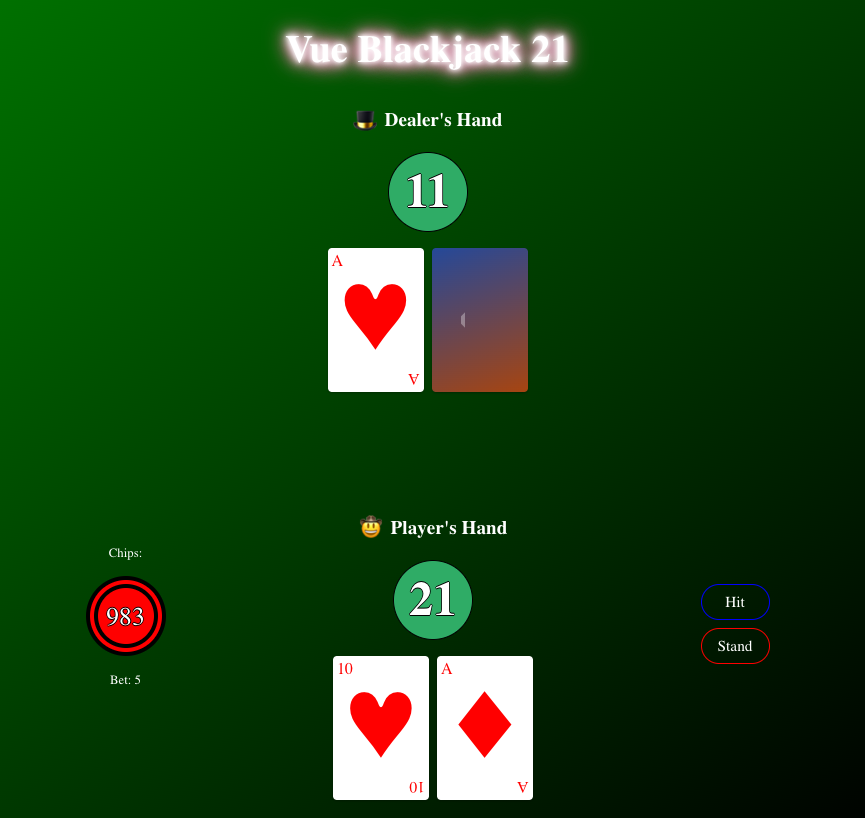

# 🃏 Vue Blackjack 21 🃏

Welcome to the Vue Blackjack 21 GitHub repository! This dynamic project takes your gaming experience to the next level with Vue.js. With our interactive and sleek user interface, you can play one of the most popular casino games - Blackjack - right in your browser. Whether you're an experienced player or new to the game, Vue Blackjack 21 is designed to provide a fun and engaging gameplay experience. The game is responsive and user-friendly, offering features such as dynamic betting, game control buttons for hit, stand, and restart, and real-time updates on your game status. Plus, the dealer's AI is designed to keep the game challenging and exciting. Brace yourself for the fun and excitement, and try your luck with Vue Blackjack 21! Whether you hit or stand, the fun never ends with Vue Blackjack 21!

## Live Website 🌐

### [Vue Blackjack 21](https://vue-blackjack21.vercel.app/)

## Developer 🤝

### 🧑‍💻 [David Benner](https://github.com/davebenner14)

## Technologies Used 💻

- [Vue.js](https://vuejs.org/guide/introduction.html)
- [JavaScript](https://developer.mozilla.org/en-US/docs/Web/JavaScript)
- [HTML](https://developer.mozilla.org/en-US/docs/Web/HTML)
- [CSS](https://developer.mozilla.org/en-US/docs/Web/CSS)

## Screenshots 📸



## Getting Started Yourself 🚀

To get started with this project, follow these steps:

First, install Vue CLI, if you haven't already, using the following command:

```
npm install -g @vue/cli
```

Create a new Vue.js project using:

```
vue create <project name>
```

Install the required dependencies:

```
npm install
```

Test your application:

```
npm run serve
```

## Game Flow and Actions 🎮

The Game Flow Component is a Vue.js-based solution designed to facilitate seamless interaction and state management within the Vue Blackjack 21 game. The component allows users to perform various game actions such as start a game, place a bet, hit, stand, and restart, offering an immersive gaming experience. It maintains the game state in a reactive object named gameState and employs a set of methods bound to game actions, ensuring each action reflects in the game state in real-time. The component offers essential methods: startGame, placeBet, hit, stand, nextHand, and restartGame. The startGame method initializes the game by setting up the player and dealer hands. The placeBet method allows users to place a bet before starting a round, while hit and stand actions facilitate the main gameplay mechanics. Lastly, nextHand and restartGame methods are responsible for proceeding to the next round or resetting the game respectively.

For detailed implementation, developers can integrate the component into their Vue.js applications, adapting the HTML structure and functionality as required to effectively manage their game flow.

```
<template>
  <div>
    <!-- Your template code here -->
  </div>
</template>

<script>
import GameState from "../helpers/GameState";
import gameActions from "./BlackjackGameActions.js";

export default {
  setup() {
    const gameState = GameState();
    const gameFunctions = gameActions(gameState);

    return {
      ...gameState,
      ...gameFunctions,
    };
  },
};
</script>


```

In BlackjackGameActions.js, several functions handle the main flow of the game. They control actions like starting a game, making a hit, standing, and resetting the game. Below is a simplified version of the startGame, hit, and stand functions.

```
export default function (gameState) {
  const { player, dealer, startGame: startGameOriginal, deck } = gameState;

  // Start game and draw two cards for player and dealer
  function startGame() {
    startGameOriginal();
    player.value.hand = [deck.drawCard(), deck.drawCard()];
    dealer.value.hand = [
      deck.drawCard(),
      { ...deck.drawCard(), faceDown: true },
    ];
  }

  // When player chooses to hit, draw a new card for the player
  function hit() {
    let result = hitPlayer(player.value.hand, deck);
    player.value.hand = result.playerHand;

    if (result.gameOver) {
      gameState.gameStatus.value.ended = true;
    }
  }

  // Player stands and dealer's play begins, game outcome is decided
  function stand() {
    gameState.dealerTurn.value = true;
    let result = standDealer(dealer.value.hand, deck);
    dealer.value.hand = result.dealerHand;

    if (result.gameOver) {
      gameState.gameStatus.value.ended = true;
    }
  }

  // More functions for game flow control like `compareHands`, `nextHand` and `restartGame` are present in the complete file

  return {
    startGame,
    hit,
    stand,
  };
}

```

## Going Forward 🚀

Thank you for stepping into the world of Vue Blackjack 21 and experiencing its dynamic gaming capabilities! We hope you find this tool not only entertaining but also a practical demonstration of Vue.js's potential for creating rich interactive experiences. Your journey with Vue Blackjack 21 matters to us, and we are eager to hear your feedback, thoughts, and any enhancements you'd like to propose. Together, let's push the boundaries of Vue.js gaming applications and make your projects even more engaging and enjoyable! Happy coding, and may Vue Blackjack 21 ace your development journey! 🎉😊
